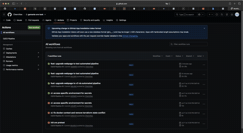
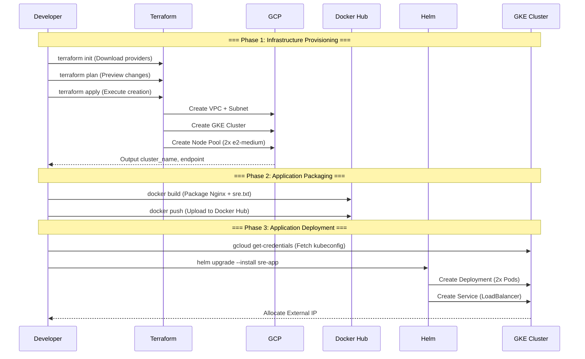
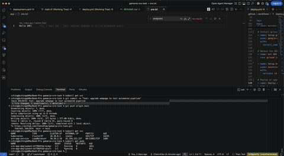

# Gamania SRE Pretest - Cloud-Native Deployment & Automation

## Personal Statement & Reflection

First and foremost, **I would like to extend my sincere gratitude to the team for inviting me to take this pretest.** I truly appreciate this opportunity to challenge myself, step out of my comfort zone, and showcase my potential to the team. 

To share a bit of my journey: Coming from a **Backend Engineering background**, I previously had experience with Docker and basic CI/CD pipelines, but **this assignment marked my very first hands-on experience with Kubernetes (GKE), Terraform, and Helm.**

Because these cloud-native orchestration tools were entirely new to me, I treated this pretest as an intensive learning opportunity. I fully utilized Generative AI tools (such as Claude Code/Gemini) not just to generate configuration templates, but as an interactive mentor to study the underlying architectures.

Through this process, I successfully accelerated my upskilling and achieved a profound **macro-level understanding of cloud infrastructure**, including:
*   How Infrastructure as Code (IaC) via Terraform manages lifecycle states remotely.
*   The networking dichotomy between Layer 4 Service and Layer 7 Ingress routing inside Kubernetes.
*   How Helm manages template-driven, environment-agnostic deployments (GitOps concepts).

Completing this deployment and watching the automated pipeline run successfully has given me an **immense sense of achievement**. I have thoroughly reviewed, tested, and understood every piece of code submitted in **this repository, and I am incredibly excited about the prospect of bringing this fast-learning capability to the team.**

---

## Generative AI Disclosure & Prompt Log

In strict accordance with the assignment guidelines, here is the disclosure of how Generative AI assisted me in completing this task:

### 1. AI Assistance Mapping
* **Question 1 (Terraform):** Used AI to generate the baseline GKE and custom VPC resource blocks, and to understand best practices regarding default node pool removal.
* **Question 3 & 6 (Helm Chart & Ingress):** Used AI to construct the Helm directory skeleton and to understand how `annotations` dynamically link Cloud Armor with L7 Ingress.
* **Question 4 & 5 (GitHub Actions & GitOps):** Used AI to optimize multi-stage pipeline sequencing (Build -> Deploy) and conditional branch switching logic.

### 2. Sample Prompts Used During Development
To give visibility into my iterative learning process, here are the key prompts utilized:

> **Prompt 1 (Understanding Architecture):**
> *"I am a backend engineer learning GKE. Explain to me why we should separate the GKE cluster definition from the managed node pool in Terraform. Provide a production-ready example including a custom VPC."*

> **Prompt 2 (Problem Solving & L4 vs L7):**
> *"I currently have a Kubernetes Service set to type: LoadBalancer. If I want to attach a Google Cloud Armor policy to protect my Nginx app, why do I need to transition to an Ingress? Show me how to set up the Helm values and ingress annotations for GCE Ingress."*

> **Prompt 3 (CI/CD Automation):**
> *"Write a GitHub Actions workflow that builds a Docker image with a Git SHA tag on push to main branch, connects to GKE, and executes a helm upgrade. Ensure the helm command dynamically selects different value files based on the branch name."*

---

## Project Structure

```
.
├── .github/workflows/deploy.yml   # Q4 - CI/CD Pipeline
├── app/
│   ├── Dockerfile                  # Q2 - Nginx Containerization
│   └── sre.txt                     # Q2 - Hello SRE!
├── helm/sre-app/
│   ├── Chart.yaml                  # Q3 - Helm Chart Definition
│   ├── values.yaml                 # Q3 - Configurable Parameters
│   └── templates/
│       ├── deployment.yaml         # Q3 - K8s Deployment
│       └── service.yaml            # Q3 - K8s Service (LoadBalancer)
├── terraform/
│   ├── main.tf                     # Q1 - VPC + GKE Cluster
│   ├── variables.tf                # Q1 - Variable Definitions
│   └── outputs.tf                  # Q1 - Output Values
└── README.md
```

## Prerequisites

| Tool | Purpose | Installation |
|------|---------|--------------|
| Docker | Build and test container images | [docker.com](https://docs.docker.com/get-docker/) |
| gcloud CLI | Manage GCP resources and obtain GKE credentials | [cloud.google.com](https://cloud.google.com/sdk/docs/install) |
| Terraform | Manage GCP infrastructure as code | [terraform.io](https://developer.hashicorp.com/terraform/install) |
| kubectl | Interact with Kubernetes clusters | `gcloud components install kubectl` |
| Helm | Package and deploy K8s applications | [helm.sh](https://helm.sh/docs/intro/install/) |

---

## GCP Setup

Complete the following setup on GCP before starting:

### Step 1: Create a GCP Project and Enable Required APIs

```bash
# Log in to GCP
gcloud auth login

# Create a project
gcloud projects create GCP_PROJECT_ID --name="SRE Pretest"

# Set the active project
gcloud config set project GCP_PROJECT_ID

# Enable required GCP APIs (GKE, Compute Engine, Container Registry)
gcloud services enable container.googleapis.com
gcloud services enable compute.googleapis.com
gcloud services enable containerregistry.googleapis.com
```

### Step 2: Create a Service Account (for Terraform and CI/CD)

```bash
# Create a Service Account
gcloud iam service-accounts create sre-deployer \
  --display-name="SRE Deployer"

# Grant necessary permissions (Kubernetes Admin, Compute Admin, Service Account User)
gcloud projects add-iam-policy-binding GCP_PROJECT_ID \
  --member="serviceAccount:sre-deployer@GCP_PROJECT_ID.iam.gserviceaccount.com" \
  --role="roles/container.admin"

gcloud projects add-iam-policy-binding GCP_PROJECT_ID \
  --member="serviceAccount:sre-deployer@GCP_PROJECT_ID.iam.gserviceaccount.com" \
  --role="roles/compute.admin"

gcloud projects add-iam-policy-binding GCP_PROJECT_ID \
  --member="serviceAccount:sre-deployer@GCP_PROJECT_ID.iam.gserviceaccount.com" \
  --role="roles/iam.serviceAccountUser"

# Download the Service Account JSON key
gcloud iam service-accounts keys create gcp-sa-key.json \
  --iam-account=sre-deployer@GCP_PROJECT_ID.iam.gserviceaccount.com
```

### Step 3: Set Up Docker Hub

1. Get **username** and **Access Token** from  [Docker Hub](https://hub.docker.com/).

### Step 4: Configure GitHub Secrets

Add the following secrets in GitHub repository:

| Secret Name | Value
|---|---|
| `DOCKERHUB_USERNAME` | Docker Hub username
| `DOCKERHUB_TOKEN` | Docker Hub Access Token 
| `GCP_SA_KEY` | Full contents of `gcp-sa-key.json`
| `GCP_PROJECT_ID` | GCP Project ID

---

## Deployment Walkthrough

Below are the step-by-step commands to manually deploy the entire service:

### Step 1: Test Docker Image Locally (Q2)

```bash
# Build the image
docker build -t custom-nginx:latest ./app/

# Run the container locally
docker run -d --name sre-test -p 8080:80 custom-nginx:latest

# Verify (should display "Hello SRE!")
curl http://localhost:8080/sre.txt

# Clean up after testing
docker stop sre-test && docker rm sre-test
```

### Step 2: Push Image to Docker Hub (Q2)

```bash
# Log in to Docker Hub
docker login -u DOCKERHUB_USERNAME

# Tag and push
docker tag custom-nginx:latest DOCKERHUB_USERNAME/custom-nginx:latest
docker push DOCKERHUB_USERNAME/custom-nginx:latest
```

### Step 3: Create GKE Cluster with Terraform (Q1)

```bash
# Set up GCP credentials for Terraform
gcloud auth application-default login

# Initialize Terraform
cd terraform/
terraform init

# Preview resources (verify the plan)
terraform plan -var="project_id=GCP_PROJECT_ID"

# Create the cluster (takes approximately 5-10 minutes)
terraform apply -var="project_id=GCP_PROJECT_ID"

# Obtain cluster credentials so kubectl can access the cluster
gcloud container clusters get-credentials sre-gke-cluster \
  --zone asia-east1-a \
  --project GCP_PROJECT_ID

# Verify cluster connection
kubectl cluster-info
kubectl get nodes

cd ..
```

### Step 4: Deploy Application to GKE with Helm (Q3)

```bash
# Deploy the Helm Chart (replace with Docker Hub username)
helm install sre-app ./helm/sre-app \
  --set image.repository=DOCKERHUB_USERNAME/custom-nginx \
  --set image.tag=latest

# Wait for Pods to become ready
kubectl get pods -w

# Watch the Service until EXTERNAL-IP changes from <pending> to an actual IP
kubectl get svc sre-app-service -w

# Test external IP with a browser or curl
curl http://EXTERNAL_IP/sre.txt
```

### Step 5: Set Up CI/CD Automation (Q4)

```bash
# Initialize Git repository
git init
git add .
git commit -m "Initial SRE pretest submission"

# Create a GitHub repository and push
git remote add origin git@github.com:USERNAME/gamania-sre-task.git
git branch -M main
git push -u origin main

```

### Resource Cleanup

```bash
# Delete the Helm Release
helm uninstall sre-app

# Destroy the GKE cluster and all Terraform-managed resources
cd terraform/
terraform destroy -var="project_id=GCP_PROJECT_ID"
```

---

## Q1 - Terraform: Create a Kubernetes Cluster

> Write Terraform source code, to establish a runnable Kubernetes cluster on the Cloud Provider (AWS, GCP, Azure … etc) of  choice. If there are any other architectures and cloud services that you believe are necessary, please also include them in the configuration file.

**Referenced Files:**

| File | Description |
|------|-------------|
| `terraform/main.tf` | VPC, Subnet, GKE Cluster, and Node Pool definitions |
| `terraform/variables.tf` | Centralized variable definitions (project ID, region, zone, node count, machine type) |
| `terraform/outputs.tf` | Output values (cluster name, zone, endpoint, credentials command) |

**Task Breakdown:**

- Use Terraform to create a minimal, runnable GKE cluster on GCP
- Include a custom VPC network and subnet configuration instead of using the default network
- Configure the GKE cluster with minimal specs (2 nodes, e2-medium machine type) to minimize testing costs
- Include detailed comments in the code explaining each resource block

**Commands:**

```bash
# Log in to GCP (required on first use)
gcloud auth application-default login

# Navigate to the terraform directory
cd terraform/

# 1. Initialize Terraform (download provider plugins)
terraform init

# 2. Preview resources to be created (verify the plan)
terraform plan -var="project_id=GCP_PROJECT_ID"

# 3. Apply the deployment (create all resources on GCP)
terraform apply -var="project_id=GCP_PROJECT_ID"

# 4. After deployment, obtain the GKE cluster kubeconfig
gcloud container clusters get-credentials sre-gke-cluster --zone asia-east1-a --project GCP_PROJECT_ID
```

---

## Q2 - Application Containerization (Dockerfile)

> Write a Dockerfile based on the nginx base image, and place a file containing the text "Hello SRE!" (file name: sre.txt) into nginx, so that this string can be accessed on the browser via the /sre.txt path. Please provide the complete Dockerfile and related instructions.

**Referenced Files:**

| File | Description |
|------|-------------|
| `app/Dockerfile` | Nginx containerization using `nginx:alpine` as the base image |
| `app/sre.txt` | Contains the text "Hello SRE!" |

**Task Breakdown:**

- Use the lightweight and secure `nginx:alpine` as the base image
- Create `sre.txt` with the content `Hello SRE!`
- In the Dockerfile, copy `sre.txt` to Nginx's default web root directory so users can access it via the `/sre.txt` path

**Commands:**

```bash
# Build the Docker image
docker build -t custom-nginx:latest ./app/

# Run the container locally (map port 8080 to the container's port 80)
docker run -d -p 8080:80 custom-nginx:latest

# Test: Open http://localhost:8080/sre.txt in a browser — it should display "Hello SRE!"

# Push to Docker Hub (required before deploying to K8s)
docker tag custom-nginx:latest -dockerhub-username/custom-nginx:latest
docker push -dockerhub-username/custom-nginx:latest
```

---

## Q3 - Helm Chart Packaging & Deployment

> Write kubernetes manifest or helm chart, that deploy the nginx image you customized in question 2 to the Kubernetes cluster you built in question 1, and use the Load balancer to allow external users to access  service. If there are any other architectures and cloud services that you believe need to be added to make a user-facing web service more complete, please also include them in the build configuration file, or explain them in the instruction document. Leveraging Helm chart or Kustomize as package manager is encouraged. Screenshot the entire screen or any way to demonstrate  great work is encouraged.

### Demo: Deployment Result



**Referenced Files:**

| File | Description |
|------|-------------|
| `helm/sre-app/Chart.yaml` | Helm Chart metadata (name, version, appVersion) |
| `helm/sre-app/values.yaml` | Configurable parameters (image, replicas, service type, resources, health check) |
| `helm/sre-app/templates/deployment.yaml` | K8s Deployment with readiness/liveness probes and resource limits |
| `helm/sre-app/templates/service.yaml` | K8s Service of type LoadBalancer for external access |

**Task Breakdown:**

- Create a standard Helm Chart structure named `sre-app`
- Include a Deployment (deploying the custom image with readiness/liveness probes and resource requests/limits)
- Include a Service with type `LoadBalancer` so external users can access the application
- Document key configurable variables in `values.yaml`

**Commands:**

```bash
# Verify connection to the GKE cluster (last step from Q1)
kubectl cluster-info

# First-time Helm Chart installation
helm install sre-app ./helm/sre-app \
  --set image.repository=-dockerhub-username/custom-nginx \
  --set image.tag=latest

# Update the deployment (after modifying configuration)
helm upgrade sre-app ./helm/sre-app \
  --set image.repository=-dockerhub-username/custom-nginx \
  --set image.tag=latest

# Check deployment status
kubectl get pods
kubectl get svc

# Get the LoadBalancer's external IP
kubectl get svc sre-app-service -w

# Test using the external IP: http://EXTERNAL_IP/sre.txt
```

---

## Q4 - GitHub Actions CI/CD Pipeline

> Please write a simple CI/CD Pipeline, which allows you to build and deploy the infrastructure and image files you have created in a series of previous questions through this pipeline. Complete a simple but complete CI/CD process in  mind. Of course, you are free to add any steps as  desire which is needed to be added to the pipeline. If possible, please explain each step simply by comments in the pipeline script.



### Demo: CI/CD Pipeline Execution



**Referenced Files:**

| File | Description |
|------|-------------|
| `.github/workflows/deploy.yml` | CI/CD pipeline with build, push, and Helm deploy stages |

**Task Breakdown:**

- Trigger automatically when code is pushed to the `main` branch
- Stage 1: Build the Docker image and push it to Docker Hub
- Stage 2: Run Terraform Apply to ensure the K8s cluster on GCP is up to date (currently commented out for cost savings)
- Stage 3: Run Helm Upgrade to deploy the application to the cluster
- Include detailed comments above each step in the YAML explaining its purpose and logic

**How to Trigger:**

```bash
# The pipeline triggers automatically on push to the main branch
git add .
git commit -m "Initial SRE pretest submission"
git push origin main
```

---

## Q5 - GitOps Multi-Environment Deployment

**Original:**

> Please describe, with examples if possible, how to use the concept of GitOps, the CI/CD Pipeline you built in question 4 can support multi-environment deployments (such as alpha, beta, staging, production) based on the same codebase or package manager.

**Referenced Files:**

| File | Description |
|------|-------------|
| `.github/workflows/deploy.yml` | Pipeline that can be extended with branch-based environment selection |
| `helm/sre-app/values.yaml` | Base values file; environment-specific overrides can be layered on top |

**Explanation:**

The core concept of GitOps is to use **Git as the Single Source of Truth**, managing multi-environment deployments through branch strategies or directory structures.

### Approach 1: Branch-Based Strategy

Each environment maps to a branch, and the CI/CD pipeline determines the deployment target based on the branch name:

```
main       → production environment
staging    → staging environment
develop    → alpha/beta environment
```

In `deploy.yml`, determine the deployment environment based on the branch:

```yaml
on:
  push:
    branches: [main, staging, develop]

env:
  ENVIRONMENT: ${{ github.ref_name == 'main' && 'production' || github.ref_name == 'staging' && 'staging' || 'alpha' }}
```

### Approach 2: Overlay-Based Strategy (Recommended)

Use the same Helm Chart but create separate values files for each environment:

```
helm/sre-app/
├── values.yaml                # Default values (shared base configuration)
├── values-alpha.yaml          # Alpha environment overrides (replica: 1, smaller resources)
├── values-staging.yaml        # Staging environment overrides (replica: 2)
└── values-production.yaml     # Production environment overrides (replica: 3, larger resources)
```

During deployment, specify the environment-specific values file:

```bash
helm upgrade --install sre-app ./helm/sre-app \
  -f ./helm/sre-app/values.yaml \
  -f ./helm/sre-app/values-production.yaml
```

### Approach 3: ArgoCD Integration (GitOps Tool)

Install ArgoCD in the cluster and create an Application CRD for each environment. ArgoCD automatically monitors the Git repository for changes and synchronizes deployments, achieving a complete GitOps workflow.

---

## Q6 - Linking Terraform Resources with Helm

> Continuing from questions 4 and 5, if  web service needs to reference resources created by Terraform, what method would you use to link them? For example, In the Helm chart of the web service there may be a need to fill in the name of a CloudArmor policy created by Terraform as an annotation.

**Referenced Files:**

| File | Description |
|------|-------------|
| `terraform/outputs.tf` | Terraform outputs that expose resource names (e.g., cluster name, zone, endpoint) |
| `.github/workflows/deploy.yml` | CI/CD pipeline where Terraform outputs can be read and passed to Helm via `--set` |
| `helm/sre-app/templates/deployment.yaml` | Helm template where annotations referencing Terraform resources can be added |

**Explanation:**

When Helm Charts need to reference resources created by Terraform (e.g., CloudArmor policy names, static IPs), common linking methods include:

### Approach 1: Terraform Output + CI/CD Variable Passing (Recommended)

Define the resource names that need to be referenced as Terraform outputs:

```hcl
# terraform/outputs.tf
output "cloud_armor_policy_name" {
  value = google_compute_security_policy.default.name
}
```

In the CI/CD pipeline, read the output and pass it to Helm via `--set`:

```yaml
# .github/workflows/deploy.yml
- name: Get Terraform outputs
  working-directory: ./terraform
  run: |
    echo "ARMOR_POLICY=$(terraform output -raw cloud_armor_policy_name)" >> $GITHUB_ENV

- name: Deploy with Helm
  run: |
    helm upgrade --install sre-app ./helm/sre-app \
      --set annotations.cloudArmorPolicy=${{ env.ARMOR_POLICY }}
```

### Approach 2: Terraform Remote State Data Source

Use the `terraform_remote_state` data source to read outputs from another Terraform state file. This is suitable for cross-referencing resources between multiple Terraform projects.

### Approach 3: Dynamic GCP API Query

Query resource names directly using `gcloud` commands in the CI/CD pipeline, without depending on the Terraform state:

```bash
POLICY_NAME=$(gcloud compute security-policies list --format="value(name)" --filter="name~sre")
helm upgrade --install sre-app ./helm/sre-app --set annotations.cloudArmorPolicy=$POLICY_NAME
```
